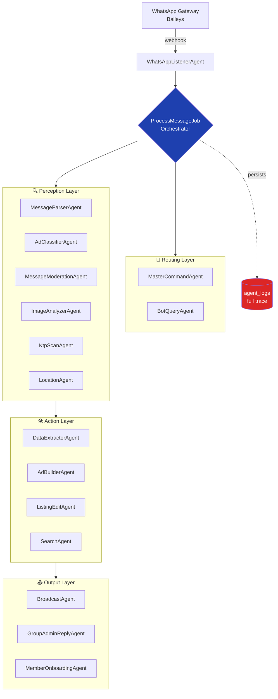
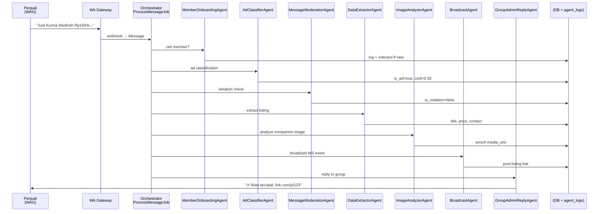

# Marketplace Jamaah AI

> **Multi-agent AI system yang mengubah obrolan WhatsApp Group pengajian menjadi marketplace digital — tanpa user perlu install aplikasi apapun.**

Sistem ini terdiri dari **16 AI agent yang saling berkolaborasi** untuk memproses pesan WhatsApp Group secara real-time: mendeteksi iklan, mem-moderasi konten, mengekstraksi data terstruktur, menganalisis foto produk, membangun listing, hingga merespons balik ke grup — semua tanpa intervensi manual.

> Disubmit ke **QHomemart AI Agent Competition 2026** — kategori "Build Real AI Agent. Solve Real Problems".

---

## 🎯 Problem Statement

Ekonomi umat di Indonesia banyak terjadi di **WhatsApp Group** komunitas (pengajian, masjid, RT/RW). Tapi:

- **Jamaah tidak mau install marketplace baru** — barrier UX terlalu tinggi untuk segmen ibu-ibu pengajian, ustadz, lansia.
- **Pesan jualan tenggelam** dalam ratusan obrolan harian — tidak ada history, tidak searchable, tidak ada link permanen.
- **Admin grup kewalahan** memoderasi scam, judol, riba, dan pesan non-jualan secara manual.
- **Penjual kehilangan calon pembeli** yang baru bergabung setelah iklan tenggelam.

## 💡 Solusi

**Marketplace Jamaah AI** mendengarkan WhatsApp Group secara real-time. Ketika ada pesan masuk, **multi-agent system** memprosesnya dalam pipeline yang berurutan:

1. Klasifikasi (iklan vs non-iklan vs violation)
2. Moderasi (deteksi scam/judol/riba dengan auto-warning 3-strike)
3. Ekstraksi terstruktur (judul, harga, kontak, lokasi, kategori, kondisi)
4. Vision analysis untuk foto produk
5. Pembuatan listing + link permanen
6. Auto-reply ke grup dengan link marketplace

Hasilnya: **setiap iklan jamaah otomatis tercatat di marketplace web** dengan link permanen yang searchable, sambil tetap muncul di grup seperti biasa.

---

## 🤖 Arsitektur Multi-Agent

### Topology



### Sequence Diagram — Pipeline Iklan Lengkap



### Pembagian Peran (Kriteria #2: Kolaborasi Terstruktur)

| Layer | Agent | Tanggung Jawab | LLM |
|---|---|---|---|
| 🎧 Listener | `WhatsAppListenerAgent` | Webhook receiver dari Baileys gateway | — |
| 🧭 Brain | `MasterCommandAgent` | Privileged command dari owner (broadcast, override) | Gemini |
| 🧭 Brain | `BotQueryAgent` | Intent routing untuk DM (search/edit/builder/help) | Gemini/Groq |
| 🔍 Perception | `MessageParserAgent` | Parse struktur pesan (text/quote/mention) | rule-based |
| 🔍 Perception | `AdClassifierAgent` | Klasifikasi iklan vs non-iklan | Gemini |
| 🔍 Perception | `MessageModerationAgent` | Deteksi scam/judol/riba/violation | Gemini |
| 🔍 Perception | `ImageAnalyzerAgent` | Vision: extract product info dari foto | Gemini Vision |
| 🔍 Perception | `KtpScanAgent` | OCR KTP untuk verifikasi member | Gemini Vision |
| 🔍 Perception | `LocationAgent` | Extract & geocode lokasi | Gemini |
| 🛠 Action | `DataExtractorAgent` | Extract listing terstruktur (title/price/contact/cat) | Gemini |
| 🛠 Action | `AdBuilderAgent` | Conversational builder iklan via DM (multi-turn) | Gemini |
| 🛠 Action | `ListingEditAgent` | Edit listing via natural language | Gemini |
| 🛠 Action | `SearchAgent` | Semantic search marketplace | Gemini |
| 📤 Output | `BroadcastAgent` | Repost listing ke WAG + WS event | rule-based |
| 📤 Output | `GroupAdminReplyAgent` | Auto-reply (konfirmasi/peringatan) | rule + template |
| 📤 Output | `MemberOnboardingAgent` | Onboard contact baru via DM | rule + Gemini |

---

## 📊 Log Interaksi & Reasoning Trace

Setiap interaksi antar-agent **wajib tercatat** dan dapat dilacak (kriteria teknis lomba). Sistem ini meng-implementasikan **structured agent log** di tabel `agent_logs`:

```php
Schema::create('agent_logs', function (Blueprint $table) {
    $table->string('agent_name');
    $table->foreignId('message_id')->nullable();
    $table->json('input_payload');     // apa yang masuk ke agent
    $table->json('output_payload');    // hasil reasoning + decision
    $table->enum('status', ['pending','processing','success','failed','skipped']);
    $table->text('error')->nullable();
    $table->unsignedInteger('duration_ms');  // performa per agent
    $table->unsignedTinyInteger('retry_count');
    $table->timestamps();
});
```

**Setiap message** dapat ditrace lewat seluruh pipeline:

```sql
SELECT agent_name, status, duration_ms, output_payload->>'$.reasoning' AS reasoning
FROM agent_logs WHERE message_id = ? ORDER BY created_at;
```

---

## 🚀 Quick Start (Reproducibility — Kriteria #5)

### Opsi A: Docker (recommended)

```bash
git clone https://github.com/jodyaryono/marketplacejamaah-ai
cd marketplacejamaah-ai
cp .env.example .env

# 1. Set required secrets di .env (lihat bagian "Required Env Vars" di bawah)
#    - GEMINI_API_KEY (required)
#    - DB_PASSWORD, DB_ROOT_PASSWORD
#    - APP_KEY (auto-generate di step 3)

# 2. Start containers
docker-compose up -d

# 3. Setup app
docker-compose exec app php artisan key:generate
docker-compose exec app php artisan migrate --seed

# App: http://localhost:8000
# Reverb (WebSocket): ws://localhost:8080
```

### Opsi B: Native (Laravel Herd / Laragon / Valet)

```bash
git clone https://github.com/jodyaryono/marketplacejamaah-ai
cd marketplacejamaah-ai
cp .env.example .env
composer install
npm install && npm run build
php artisan key:generate
php artisan migrate --seed
php artisan queue:work &
php artisan reverb:start &
php artisan serve
```

### Required Env Vars (minimum untuk demo)

| Variable | Wajib? | Keterangan |
|---|---|---|
| `APP_KEY` | ✅ | `php artisan key:generate` |
| `DB_DATABASE` / `DB_USERNAME` / `DB_PASSWORD` | ✅ | MySQL connection |
| `GEMINI_API_KEY` | ✅ | Google AI Studio (free tier OK untuk demo) |
| `GROQ_API_KEY` | optional | Fallback / faster routing |
| `WA_GATEWAY_URL` / `WA_GATEWAY_TOKEN` | optional | Baileys-compatible gateway. Tanpa ini, agent tetap bisa di-test via test suite + tinker. |
| `WA_MASTER_PHONE` | optional | Privileged owner phone untuk MasterCommandAgent |

> ⚠️ **Secrets hygiene**: `.env` ada di `.gitignore`. **Jangan pernah commit credential**. Gunakan `.env.example` sebagai template (key + placeholder kosong).

---

## 🧪 Demo End-to-End

### 1. Demo pipeline end-to-end (one-liner, no WA gateway needed)

```bash
# Skenario iklan valid → trigger 16-agent pipeline + cetak reasoning trace
php artisan demo:pipeline ad

# Skenario violation (scam/judol) → trigger moderasi + warning
php artisan demo:pipeline violation

# Skenario foto-only → trigger ImageAnalyzerAgent (Gemini Vision)
php artisan demo:pipeline image-only

# Skenario search via DM → trigger BotQueryAgent → SearchAgent
php artisan demo:pipeline search

# Cleanup setelah selesai
php artisan demo:pipeline ad --cleanup
```

Output (contoh untuk `demo:pipeline ad`):

```
🤖 AGENT REASONING TRACE
──────────────────────────────────────────────────────────────────────
 # | Agent                       | Duration | Output (key fields)
 1 | ✓ MemberOnboardingAgent     | 12ms     | (skipped — existing contact)
 2 | ✓ MessageParserAgent        | 4ms      | word_count=12, has_price=true
 3 | ✓ AdClassifierAgent         | 612ms    | is_ad=true, confidence=0.92
 4 | ✓ MessageModerationAgent    | 587ms    | is_violation=false, category=ad
 5 | ✓ DataExtractorAgent        | 821ms    | title=Kurma Ajwa, price=280000
 6 | ✓ BroadcastAgent            | 23ms     | (websocket dispatched)
 7 | ✓ GroupAdminReplyAgent      | 19ms     | (reply sent: confirmation)

📊 PIPELINE RESULT
──────────────────────────────────────────────────────────────────────
  ✅ Listing Created
    id          : 1
    title       : Jual Kurma Ajwa Premium 1kg Rp280.000
    price       : Rp 280.000
    contact     : 6285812345678
    location    : Bandung
    permanent   : http://localhost/p/1

  ⏱  Total: 2078ms across 7 agent calls
```

### 2. Manual via tinker (untuk eksplorasi)

```bash
php artisan tinker
```

```php
$msg = \App\Models\Message::create([
    'sender_number' => '6281234567890',
    'raw_body' => 'Jual Kurma Ajwa premium 1kg Rp280.000, WA 0858xxx',
    'message_type' => 'text',
    'whatsapp_group_id' => 1,
    'direction' => 'in',
]);
\App\Jobs\ProcessMessageJob::dispatchSync($msg->id);
\App\Models\AgentLog::where('message_id', $msg->id)->get();
$msg->refresh()->listing;
```

### 2. Test suite

```bash
php artisan test
php artisan test --filter=AgentPipeline
```

### 3. UI marketplace

- Landing: `/`
- Listing detail: `/p/{id}`
- Admin dashboard: `/admin` (login required)

---

## 🏆 Mapping ke Kriteria Penilaian QHomemart 2026

| Kriteria | Implementasi |
|---|---|
| **1. Kualitas Reasoning Agent** | Tiap agent menyimpan `input_payload` & `output_payload` (JSON) di `agent_logs`, termasuk reasoning chain dari Gemini. Threshold confidence (`ad_confidence`) per-decision. |
| **2. Kolaborasi Antar Agent** | 16 agent dengan pembagian peran 5 layer (Listener / Brain / Perception / Action / Output). Orchestrator (`ProcessMessageJob`) melakukan handoff eksplisit dengan kondisi (is_ad, is_violation, has_media). |
| **3. Dampak Dunia Nyata** | Sistem **sudah running di produksi** dengan jamaah pengajian real. Setiap iklan otomatis menjadi listing dengan permanent link, mengurangi friction transaksi UMKM Muslim yang tidak mau pakai marketplace lain. |
| **4. Kejelasan Arsitektur** | Diagram topology + sequence (Mermaid, di README ini). Layered architecture, single orchestrator pattern, separation of concerns yang konsisten. |
| **5. Reproducibility** | `docker-compose up -d` + `migrate --seed` cukup untuk replikasi penuh. `.env.example` lengkap. Agent class modular — bisa di-swap LLM provider tanpa rewrite. |

---

## 🛠 Tech Stack

- **Backend**: Laravel 11, PHP 8.3
- **Database**: MySQL 8 + Redis (cache/queue)
- **Queue**: Laravel Queue (database driver, scalable ke Redis/SQS)
- **Real-time**: Laravel Reverb (WebSocket)
- **LLM**: Google Gemini 2.0 Flash (primary), Groq Llama 3.3 (fallback)
- **WA Gateway**: Baileys-compatible HTTP gateway
- **Frontend**: Blade + Livewire + Tailwind (mobile-first)

---

## 📜 License

Proprietary. © 2026 Jody Aryono. Kode di-share untuk keperluan penjurian QHomemart AI Agent Competition 2026.

---

## 🎥 Demo Video & Pitch Deck

- **PowerPoint deck** (14 slide, brand-consistent): [`docs/pitch/marketplace-jamaah-pitch-2026.pptx`](docs/pitch/marketplace-jamaah-pitch-2026.pptx)
- **HTML deck** (single file, Ctrl+P → PDF): [`docs/pitch/index.html`](docs/pitch/index.html)
- **Demo video script** (2.5–3 menit screen recording): [`docs/pitch/demo-video-script.md`](docs/pitch/demo-video-script.md)
- **Architecture deep-dive**: [`docs/architecture.md`](docs/architecture.md)

Pitch deck cover: hero, problem, insight, solution (2 path), AI WAG admin, public catalog, kemudahan, architecture, live trace, metrics, impact jamaah, impact masyarakat, criteria mapping, CTA. Setiap slide punya speaker notes untuk juri yang baca-only.

## 📞 Kontak

- **Developer**: Jody Aryono — jodyaryono@gmail.com
- **Demo URL**: https://marketplacejamaah-ai.jodyaryono.id
- **Repo**: https://github.com/jodyaryono/marketplacejamaah-ai
- **Kode pendaftaran**: `WAGLI4HM`
