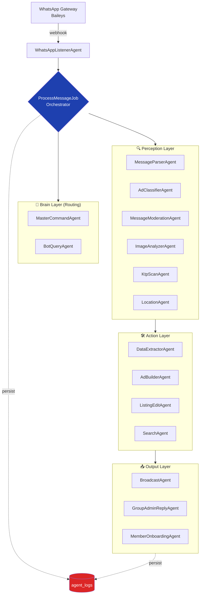
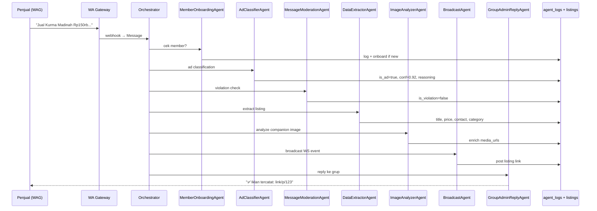
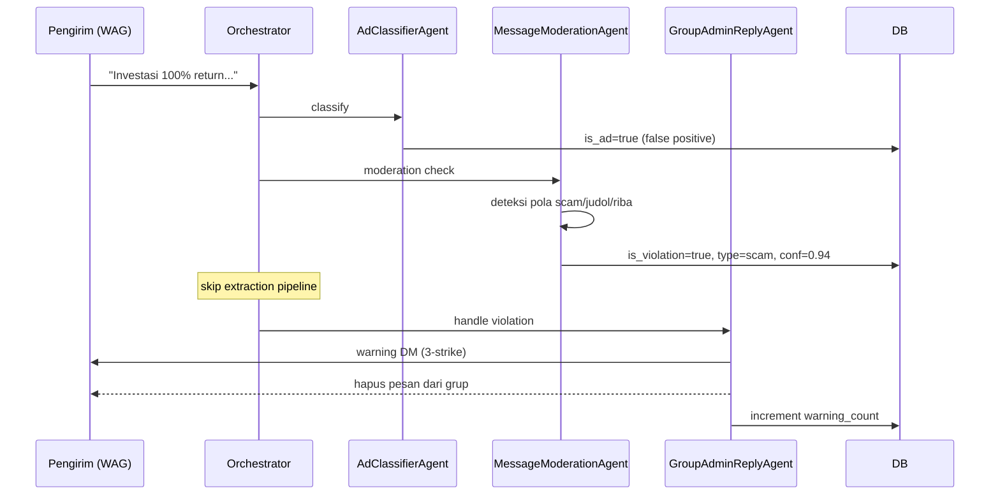

# Marketplace Jamaah AI — Arsitektur Multi-Agent

Dokumen ini menjelaskan arsitektur multi-agent system di Marketplace Jamaah AI untuk submission **QHomemart AI Agent Competition 2026**.

## Ringkasan

Marketplace Jamaah AI adalah sistem **16 AI agent** yang berkolaborasi untuk mengubah obrolan WhatsApp Group pengajian menjadi marketplace digital — tanpa user perlu install aplikasi apapun.

- **Single orchestrator** (`ProcessMessageJob`) yang melakukan handoff eksplisit antar agent berdasarkan kondisi pesan.
- **5 layer arsitektur**: Listener → Brain (routing) → Perception → Action → Output.
- **Full reasoning trace** di tabel `agent_logs` (input, output, status, duration, error).
- **Modular**: tiap agent class independent, bisa di-swap LLM provider tanpa rewrite.

---

## 1. Topology — Bagaimana Agent Diatur



---

## 2. Sequence — Pipeline Iklan Lengkap



---

## 3. Sequence — Pipeline Moderasi (Violation)



---

## 4. Pembagian Peran (Kolaborasi Terstruktur)

### Listener Layer

| Agent | Tanggung Jawab |
|---|---|
| `WhatsAppListenerAgent` | Webhook receiver dari Baileys gateway. Parse payload mentah, persist ke `messages`, dispatch `ProcessMessageJob`. |

### Brain Layer (Routing)

| Agent | Tanggung Jawab |
|---|---|
| `MasterCommandAgent` | Privileged command dari nomor owner. Bypass moderasi, support broadcast/forward/override. |
| `BotQueryAgent` | Intent routing untuk DM. Detect: cari produk, edit iklan, mark sold, ad builder, help. |

### Perception Layer

| Agent | LLM | Output |
|---|---|---|
| `MessageParserAgent` | rule-based | parsed structure (text/quote/mention) |
| `AdClassifierAgent` | Gemini 2.0 Flash | `{is_ad, confidence, reasoning}` |
| `MessageModerationAgent` | Gemini 2.0 Flash | `{is_violation, type, severity}` |
| `ImageAnalyzerAgent` | Gemini Vision | `{is_ad, title, price, visible_text, category, condition}` |
| `KtpScanAgent` | Gemini Vision | `{nik, name, address}` (untuk verifikasi member) |
| `LocationAgent` | Gemini + geocode | `{normalized_location, lat, lng}` |

### Action Layer

| Agent | LLM | Output |
|---|---|---|
| `DataExtractorAgent` | Gemini | `Listing` model lengkap |
| `AdBuilderAgent` | Gemini multi-turn | conversational state machine via DM |
| `ListingEditAgent` | Gemini | diff listing dari natural language |
| `SearchAgent` | Gemini + embeddings | ranked listing results |

### Output Layer

| Agent | Tanggung Jawab |
|---|---|
| `BroadcastAgent` | Repost listing ke WAG dengan link, dispatch WS event ke web. |
| `GroupAdminReplyAgent` | Auto-reply: konfirmasi sukses ATAU warning violation (3-strike). |
| `MemberOnboardingAgent` | DM onboard untuk contact baru, registrasi profil. |

---

## 5. Komunikasi Antar Agent

Tidak ada message bus terpisah — agent berkomunikasi via **shared state** yang dikoordinasi oleh Orchestrator:

1. **Input shared**: tiap agent menerima `Message` model + payload spesifik dari Orchestrator.
2. **Output shared**: tiap agent meng-update field di `Message` (`is_ad`, `ad_confidence`, `is_violation`, dll) atau membuat record baru (`Listing`, `Contact`).
3. **Conditional handoff**: Orchestrator memutuskan agent berikutnya berdasarkan kondisi (lihat `ProcessMessageJob.handle()`).

Pattern ini mirip **Blackboard architecture** — agent independent yang update shared state, orchestrator yang routing.

```php
// Contoh handoff di ProcessMessageJob:
$classification = $classifier->handle($message, $parsed);
$moderation     = $moderator->handle($message);

if ($classification['is_ad'] && !$moderation['is_violation']) {
    $listing = $extractor->handle($message);          // hanya jalan kalau iklan & bukan violation
    if ($message->media_url) {
        $imageAnalyzer->handle($message, $listing);   // enrich kalau ada foto
    }
}

$broadcaster->handle($message, $listing);              // selalu jalan
$groupAdmin->handle($message, $listing, $moderation); // selalu jalan
```

---

## 6. Log Interaksi & Reasoning Trace

Tabel `agent_logs` menyimpan setiap call agent secara lengkap:

```php
Schema::create('agent_logs', function (Blueprint $table) {
    $table->id();
    $table->string('agent_name');
    $table->foreignId('message_id')->nullable();
    $table->json('input_payload');     // raw input ke agent
    $table->json('output_payload');    // hasil reasoning + decision
    $table->enum('status', ['pending','processing','success','failed','skipped']);
    $table->text('error')->nullable();
    $table->unsignedInteger('duration_ms');
    $table->unsignedTinyInteger('retry_count');
    $table->timestamps();
    $table->index(['agent_name', 'status']);
    $table->index('created_at');
});
```

### Contoh trace untuk 1 pesan

```sql
SELECT agent_name, status, duration_ms,
       output_payload->>'$.confidence' AS confidence,
       output_payload->>'$.reasoning'  AS reasoning
FROM agent_logs
WHERE message_id = 12345
ORDER BY created_at;
```

| agent_name | status | duration | confidence | reasoning |
|---|---|---|---|---|
| MessageParserAgent | success | 4ms | — | structure parsed |
| AdClassifierAgent | success | 612ms | 0.92 | "Pesan mencantumkan nama barang (kurma), harga (Rp150rb), dan kontak — ciri iklan" |
| MessageModerationAgent | success | 587ms | 0.97 | "Tidak ada pola scam/judol/riba" |
| DataExtractorAgent | success | 821ms | — | extracted: title, price=150000, contact=628xxx |
| ImageAnalyzerAgent | success | 1342ms | 0.88 | "Foto produk kurma asli, ada label kemasan" |
| BroadcastAgent | success | 23ms | — | listing posted to WAG |
| GroupAdminReplyAgent | success | 19ms | — | reply sent |

**Total pipeline:** ~3.4 detik dari pesan masuk → listing tersedia di marketplace.

---

## 7. Modularitas & Reproducibility

- **LLM-agnostic**: tiap Perception/Action agent meng-inject `GeminiService`. Swap ke Groq/OpenAI hanya butuh mengganti `Service` binding.
- **Agent independent**: tiap agent punya class sendiri di `app/Agents/`, no shared state in-memory antar agent (semua via DB).
- **Dockerized**: `docker-compose up -d` cukup untuk full stack (app + nginx + mysql + redis + queue + reverb).
- **Zero secret in repo**: semua credential via env-var. `.env.example` lengkap dengan placeholder.
- **Test suite**: `php artisan test --filter=Agent` untuk validasi tiap agent secara unit.

---

## 8. Mapping ke Kriteria Penilaian

| Kriteria QHomemart 2026 | Implementasi |
|---|---|
| **Kualitas Reasoning Agent** | Gemini reasoning chain disimpan di `output_payload.reasoning`, confidence per-decision, threshold-based handoff |
| **Kolaborasi Antar Agent** | 16 agent, 5 layer, single-orchestrator pattern, conditional handoff |
| **Dampak Dunia Nyata** | Production system aktif di marketplacejamaah-ai.jodyaryono.id dengan jamaah pengajian real |
| **Kejelasan Arsitektur** | Topology + sequence diagrams, layered architecture, clean separation of concerns |
| **Reproducibility** | Docker compose, `.env.example` lengkap, migrate --seed, modular agent classes |
